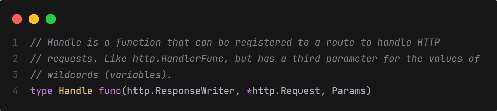
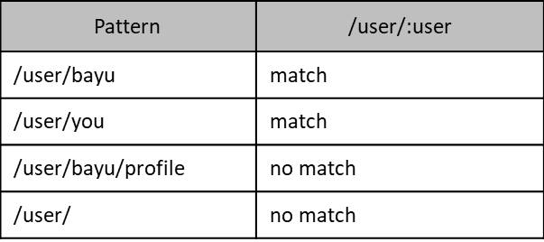
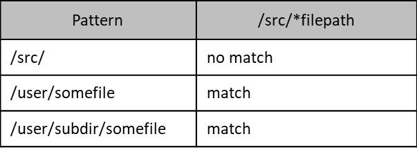

# Golang HTTP Router

# Pengenalan HttpRouter

- HttpRouter merukahan salah satu OpenSource Library yang populer `untuk Http Handler` di Go-Lang
- HttpRouter terkenal dengan kecepatannya dan juga sangat minimalis
- Hal ini dikarenakan HttpRouter hanya memiliki fitur untuk routing saja, tidak memiliki fitur apapun selain itu
- https://github.com/julienschmidt/httprouter

# Menambah HttpRouter ke Project

- go get github.com/julienschmidt/httprouter
- go get github.com/stretchr/testify

# Router

- Inti dari library HttpRouter adalah `struct Router`
- Router ini merupakan implementasi dari `http.Handler`, sehingga kita bisa dengan mudah menambahkan ke dalam http.Server, karena di Server kita butuh handler, dimana handler kita bisa memasukan di router
- Untuk membuat Router, kita bisa menggunakan function `httprouter.New()`, yang akan mengembalikan Router pointer

# HTTP Method

- Router mirip dengan `ServeMux`, dimana kita bisa menambahkan route ke dalam Router
- Kelebihan dibandingkan dengan ServeMux adalah pada Router, kita bisa menentukan HTTP Method yang ingin kita gunakan, misalnya `GET, POST, PUT, dan lain-lain`
- Cara menambahkan route ke dalam Router adalah gunakan function yang sama dengan HTTP Method nya, misal `router.GET()`, `router.POST()`, dan lain-lain

# httprouter.Handle

- Saat kita menggunakan ServeMux, ketika menambah route, kita bisa menambahkan `http.Handler`
- Berbeda dengan Router, pada Router kita tidak menggunakan http.Handler lagi, melainkan menggunakan `type httprouter.Handle`
- Perbedaan dengan http.Handler adalah pada httprouter.Handle terdapat `parameter ke tiga` yaitu `Params`

  

# Params

- httprouter.Handle memiliki parameter yang ketiga, yaitu Params. Untuk apa kegunaan Params?
- Params merupakan tempat untuk menyimpan parameter yang dikirim dari client
- Namun Params ini bukan query parameter, melainkan `parameter di URL`
- Kadang kita butuh membuat URL yang tidak fix, alias bisa berubah-ubah, misal /products/1, /products/2, dan seterusnya
- ServeMux tidak mendukung hal tersebut. Namun Router mendukung hal tersebut
- Parameter yang dinamis yang terdapat di URL, secara otomatis `dikumpulkan di Params`
- Namun, agar Router tahu, kita harus memberi tahu ketika menambahkan Route, dibagian mana kita akan buat URL path nya menjadi dinamis

# Router Pattern

- Sekarang kita sudah tahu bahwa dengan menggunakan Router, kita bisa menambahkan params di URL
- Sekarang pertanyaannya, bagaimana pattern (pola) pembuatan parameternya?

## Named Parameter

- Named parameter adalah `pola pembuatan parameter dengan menggunakan nama`
- Setiap nama parameter harus diawali dengan `: (titik dua)`, lalu diikuti dengan `nama parameter`
- Contoh, jika kita memiliki pattern seperti ini :

  

## Catch All Parameter

- Selain named parameter, ada juga yang bernama catch all parameter, yaitu menangkap semua parameter
- Catch all parameter harus diawali dengan `* (bintang)`, lalu diikuti dengan nama parameter
- Catch all parameter harus berada di posisi akhir URL

  

# Serve File

- Pada materi Go-Lang Web, kita sudah pernah membahas tentang Serve File
- Pada Router pun, dia mendukung serve static file menggunakan `function ServeFiles(Path, FileSystem)`
- Dimana pada Path, kita harus menggunakan `Catch All Parameter`
- Sedangkan pada FileSystem kita bisa melakukan manual load dari folder atau menggunakan golang embed

# Panic Handler

- Apa yang terjadi jika terjadi panic pada logic Handler yang kita buat?
- Secara otomatis akan terjadi error, dan web akan berhenti mengembalikan response
- Kadang saat terjadi panic, kita ingin melakukan sesuatu, misal memberitahu jika terjadi kesalahan di web, atau bahkan mengirim informasi log kesalahan yang terjadi
- Sebelumnya, jika kita ingin menangani panic, maka kita harus membuat Middleware khusus secara manual
- Namun di Router, hal tersebut sudah disediakan untuk menangani panic, caranya dengan menggunakan attribute PanicHandler : `func(http.ResponseWriter, *http.Request, interface{})`

# Not Found Handler

- Selain panic handler, Router juga memiliki `not found handler`
- Not found handler adalah handler yang dieksekusi ketika client mencoba melakukan request URL yang memang tidak terdapat di Router
- Secara default, jika tidak ada route yang tidak ditemukan (artinya route atau URL nya ada), maka Router akan melanjutkan request ke `http.NotFound`, namun kita bisa mengubahnya
- Caranya dengan mengubah `router.NotFound = http.Handler`

# Method Not Allowed Handler

- Saat menggunakan ServeMux, kita tidak bisa menentukan HTTP Method apa yang digunakan untuk Handler
- Namun pada Router, kita bisa menentukan HTTP Method yang ingin kita gunakan, lantas apa yang terjadi jika client tidak mengirim HTTP Method sesuai dengan yang kita tentukan?
- Maka akan terjadi error Method Not Allowed
- Secara `default`, jika terjadi error seperti ini, maka Router akan memanggil function `http.Error`
- Jika kita ingin mengubahnya, kita bisa gunakan `router.MethodNotAllowed = http.Handler`
